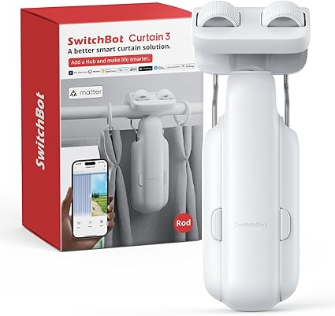
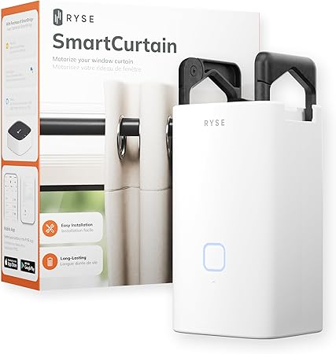
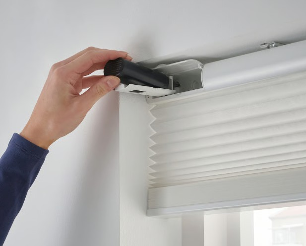
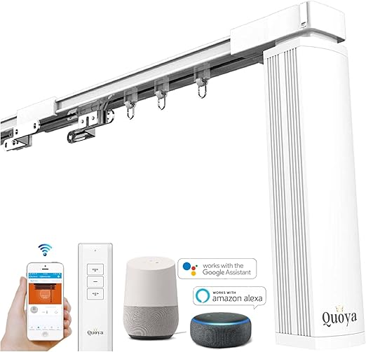
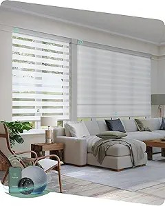

## User Needs Analysis Process

Our 4-step methodology:
- **Data Collection** - Selected 5 competing products (SwitchBot 3, RYSE, IKEA, Quoya, Yoolax). Read 20-30 Amazon reviews per product = 100+ total reviews. Captured direct quotes from positive praise + negative complaints
- **Need Extraction** - From each quote, identified 1-3 specific user needs. Explicit needs: Directly stated ("too loud", "easy install"). Latent needs: Inferred from context ("creaking" → "durable internals")
- **Need Restatement** - Rewrote ALL as solution-neutral "Device should..." statements. Removed solution assumptions ("Motor should", "App should"). Tagged each as Explicit or Latent
- **Analysis & Ranking** - Grouped 140+ needs into 7 categories. Ranked High/Medium/Low by frequency across products + customer impact. Used results to prioritize TechMinds design features

---

## 1. SwitchBot Curtain 3

**Price:** $99.99  
**Vendor:** [Amazon](https://www.amazon.com/Automatic-Rod-Bluetooth-Smartphone-Upgraded-High-Performance/dp/B0F8BR5Q66/ref=sr_1_1_sspa?crid=1XIA3QECS6L8C&dib=eyJ2IjoiMSJ9.faYlJG8XE4-_ncyBFqG0MWZ9j2bFj06O1CK0riaT1PD1KXU5jcGbNYUkOE7lL2jZ_75cpuQTQGI9VbjbFfa85LBjpOpT7OoUfcvJW4XoFyaw72fWeAPjN2r0st6JUayP2spadIGtYAph-hYXn0Jp_17VlTeqqitDKbLsLhJe8HDXegPjJZVaSmWf_luG20YFA3OAb-_cR1N9sqNLLl6rgCKr1sk7BLDrx8KEUKryR7FxxJPwynYyy19gJqagr278O23Sb3vpyprSd0W-1h6a44iQvEu5nI3zLuwwAhxM8Lo.Z7pXDlZSNauMkCwsXTPC1cMWrfYlcwMPwoJkdaGLZfQ&dib_tag=se&keywords=switchbot%2Bcurtain%2B3&qid=1757976092&sprefix=switchbot%2Bcurtain%2B%2Caps%2C196&sr=8-1-spons&sp_csd=d2lkZ2V0TmFtZT1zcF9hdGY&smid=AZJMNAZLHZV6F&th=1)

### Description
The **SwitchBot Curtain 3** is a retrofit motor that automates existing curtains.  
It offers **easy installation**, **quiet operation**, and **smart home integration**.

### Positive Comments Analysis

| Voice of the Customer | Restated User Need | Type |
|----------------------|-----------------|------|
| "This new version is absolutely silent over a bump I have in my curtain rod…Installation and instructions were super easy…Despite my heavy curtains… the device had no problem moving them." | 1. Device should operate quietly - **Explicit**   2. Installation should be easy and intuitive - **Explicit**   3. Device should handle heavy curtains reliably - **Explicit** | Explicit |
| "I got the version with the remote and I was able to add the remote to the app seamlessly and program the buttons to open and close the curtains." | 1. Device should integrate seamlessly with remote and app - **Explicit**   2. Users should be able to program open/close functions easily - **Explicit** | Explicit |
| "What I like the most is the 'QuietDrift Control' mode. This function is so quiet that you can't hear it…very useful for the bedtime routine." | 1. Device should have adjustable quiet operation modes - **Latent**   2. Device should support routines that minimize disturbance - **Latent** | Latent |
| "These work very well, even comes with the clips to use for attaching additional curtain panels…videos at the SwitchBot website and YouTube assist with installation." | 1. Device should support various curtain configurations, including multiple panels - **Explicit**   2. Installation instructions and support resources should be available - **Explicit** | Explicit |

### Negative Comments Analysis

| Voice of the Customer | Restated User Need | Type |
|----------------------|-----------------|------|
| "My Curtain Robot 3 started creaking and clacking…inside is full of broken plastic pieces." | 1. Device should be durable and robust internally - **Latent**   2. Moving parts should be reinforced to prevent breakage - **Latent** | Latent |
| "Switchbot keeps failing off the rail. Unusable." | 1. Device should stay securely attached during use - **Explicit**   2. Reliability should be consistent over time - **Latent** | Explicit/Latent |
| "Not compatible with my curtain rail as the wheels on the irail adapters are too big." | 1. Device should be compatible with a wide range of curtain rods and rails - **Explicit**   2. Adaptors should be adjustable to different sizes - **Latent** | Explicit/Latent |

---

## 2. RYSE SmartCurtain

**Price:** $149.99  
**Vendor:** [Amazon](https://www.amazon.com/RYSE-SmartCurtain-Motorized-Curtains-Automated/dp/B0DQR1XZ3P/ref=sr_1_1_sspa?dib=eyJ2IjoiMSJ9.Ch7_089fj71TLpvqE6gmiQoNCr9aax7uj0HU4oM0uBxsqLjsLws_0zkU67vz4l_qffmVH24AYyEPxweo3kXy_SUBWxLbh1vec652Llp6wPKR9jTOFUnbLQLNQNkCs7woCmfKqNQhTGXyCTFzwRHRSY7GwCHsWMvTpa4QkRy41sHfd4BSKIicaqByJd8qNnDryEwDh2PQq7vDEoPazoIazKjWHoMLFX_dlC0tSNE0cmzZCU7cVNuhvF7Lzdn16cSntIVu5PNtoGw4TpHEh67u6159L7VQ7nSs1zEeLVo4vzs.Y7nlIhEZUflXEavAH7HUHPcLzmevmw8lHeCHK1DiRek&dib_tag=se&keywords=smart+curtain+motor&qid=1757975923&sr=8-1-spons&sp_csd=d2lkZ2V0TmFtZT1zcF9hdGY&psc=1)

### Description
The **RYSE SmartCurtain** transforms your existing curtains into motorized, app-controlled drapes for effortless operation.  
It works with most curtain setups and allows remote control via **iOS** or **Android** devices.  
The device is **battery-powered**, **easy to install**, and designed for convenient, **hands-free curtain management**.

### Positive Comments Analysis

| Voice of the Customer | Restated User Need | Type |
|----------------------|-----------------|------|
| "I recently ordered these Smart Curtains, and it turns out they are incredibly easy to install—literally just a few minutes!…The set includes adhesive strips designed for curtain rods with joints or bends…You can easily adjust the curtain positioning—setting the maximum and minimum opening, fully open, or completely closed." | 1. Device should be quick and easy to install - **Explicit**   2. Device should work smoothly on rods with joints or bends - **Explicit**   3. Users should be able to set precise open/close positions - **Explicit** | Explicit |
| "I was looking for a smart device to automate my curtains and sync with Google Home…Ryse Smart Curtain is definitely more affordable. It is very easy to setup and the app is great." | 1. Device should integrate with smart home systems like Google Home - **Latent**   2. Device should be easy to set up via an app - **Latent**   3. Device should be affordable compared to alternatives - **Latent** | Latent |
| "RYSE SmartCurtain is super easy to install and makes opening and closing the curtains feel like a luxury. I love being able to control them from my phone — especially when I’m already in bed!" | 1. Device should enable convenient remote control - **Latent**   2. Device should improve the user experience / feel luxurious - **Latent**   3. Device should be installable without remodeling - **Latent** | Latent |

### Negative Comments Analysis

| Voice of the Customer | Restated User Need | Type |
|----------------------|-----------------|------|
| "The device did not come with a way to charge the battery…The device was not designed to be able to push curtains over a certain length/weight…The devices wouldn’t stay connected via Bluetooth…It makes the most hideous noise." | 1. Device should have a reliable, easy-to-use rechargeable battery - **Explicit**   2. Device should be able to handle curtains of varying length and weight - **Explicit**   3. Device should maintain stable Bluetooth connectivity - **Explicit**   4. Device should operate quietly - **Explicit** | Explicit |
| "The battery was 40% on opening the box. Strange batteries that can’t be recharged. The device can’t run routines without another purchase." | 1. Device should come with sufficient pre-charged battery - **Explicit**   2. Device should include rechargeable batteries - **Explicit**   3. Device should support automation routines without extra purchases - **Explicit** | Explicit |
| "This doesn't have the ability to bypass the brackets and therefore can't even close this entire curtain…very expensive at $300 per window." | 1. Device should work with long curtain rods that have brackets - **Latent**   2. Device should fully operate across large windows - **Latent**   3. Device should offer value for money relative to price - **Latent** | Latent |

---

## 3. IKEA Motorized Blinds

**Price:** $139.99  
**Vendor:** [IKEA](https://www.ikea.com/us/en/p/praktlysing-cellular-blind-smart-wireless-battery-operated-white-10514278/)

### Description
The **IKEA Motorized Blinds** are a sleek **solar-and-battery-powered** cellular (honeycomb) blind in white, offering **soft light filtering** while helping **insulate your room** against drafts and heat.  

They work with **IKEA’s DIRIGERA hub** and the **IKEA Home smart app** for **wireless control**, scheduling, and grouping multiple blinds.  
The blinds come **pre-paired with a remote** and include a **signal repeater** for robust wireless range.  

Powered by the **BRAUNIT rechargeable battery**, the lift mechanism provides smooth cordless operation.  
The **cordless design** makes them safer for homes with children and pets, while being made mainly from **durable recycled polyester**.

### Positive Comments Analysis

| Voice of the Customer | Restated User Need | Type |
|----------------------|-----------------|------|
| “I have had 1 of these blinds for 6–8 months… The battery lasts for several months… I recommend buying a DIRIGERA hub… It allowed us to set up a sunrise/sunset scene… The included clips make the blinds stand ~1/2" from the window frame; I had to trim mine for a snug fit.” | 1. Device should have long battery life - **Explicit**   2. Device should integrate with smart hubs like DIRIGERA for automation - **Explicit**   3. Device should support time-based scheduling - **Explicit**   4. Blinds should fit flush or allow easy trimming to fit snugly - **Explicit** | Explicit |
| “This fit so well, and was very easy to install… very lightweight… I use it daily… still the charge is holding well… Definitely worthwhile over other expensive products” | 1. Blinds should be easy and quick to install - **Latent**   2. Blinds should be lightweight - **Latent**   3. Battery should last multiple daily uses without frequent recharging - **Latent**   4. Product should provide good value compared to costlier alternatives - **Latent** | Latent |
| “For the price you can't beat these motorized smart shades… They work with Zigbee… I was able to pair them with my SmartThings hub… Super easy to install… have an internal battery that you have to take out and charge every 4–6 months” | 1. Blinds should be compatible with Zigbee and common smart hubs - **Latent**   2. Blinds should be easy to install - **Latent**   3. Blinds should have a long-lasting rechargeable battery - **Latent**   4. Blinds should offer good price-to-performance value - **Latent** | Latent |

### Negative Comments Analysis

| Voice of the Customer | Restated User Need | Type |
|----------------------|-----------------|------|
| “The string used to raise/lower the blind broke after 7 months… The blind style is currently unavailable… I have to replace all blinds” | 1. Blinds should be durable for long-term daily use - **Latent**   2. Replacement parts/styles should remain available for years - **Latent**   3. Vendor should support mix-and-match replacements to avoid replacing entire sets - **Latent** | Latent |
| “Remotes don’t work… even after replacing batteries… very thin paper that can rip easily… not completely even when opening” | 1. Remote controls should function reliably and pair easily - **Explicit**   2. Blind material should be durable and tear-resistant - **Explicit**   3. Blinds should open/close evenly and smoothly - **Explicit** | Explicit |
| “Ordered 3 blinds… 2 were defective… motor ran but blinds did not retract… rattled when tipped… 66% fail rate” | 1. Product should have consistent manufacturing quality - **Latent**   2. Product should be tested before shipping to avoid DOA defects - **Latent**   3. Product should inspire user confidence through reliability - **Latent** | Latent |

---

---

## 4. Quoya Curtain System

**Price:** $249.00  
**Vendor:** [Amazon](https://www.amazon.com/Quoya-Automated-%E3%80%90Motorized-Adjustable-Compatible/dp/B07X3XTFWS/ref=sr_1_1?crid=1SJQPVLNB4DZB&dib=eyJ2IjoiMSJ9.R0Cj2V5RyTmm_9TE1Wd0FlcAHF9SArvW-OHeo-sMraJKLgyeUc89oooGC4i8N6ID5bO0qSImKZjg4T26LR4MkzH2EuOeiLTbEbdsHkv2v7AtD8Z6FhuO4wYzq0sS_3sv-bo68ORge4Of34dq2EIej9LtUNFYWi07B62MyZLybkJYRDNgi2e_e3rdKzORi6-rLIGXSosUcvjL85BnBF4FuZdvbV3XD1vKTjQqjboIIxHZqvAqSyM-8HL-PkaIvELdtJtMgQ9qAFutvKYWmaNxxD9Ed7H6DDmZiHamW6Jvhhw.00vp0ykw_HT29if0akr0OG7vP0fcVmojQHoN3s4eVoY&dib_tag=se&keywords=motorised%2Bcurtain%2Bsystem&qid=1757986211&sprefix=aqara%2Bmotorised%2Bcurtain%2Bsystem%2Caps%2C316&sr=8-1&th=1)

### Description
The **Quoya Smart Curtain System** is a **motorized track solution** designed to automate drapes across **large windows or room spans** (up to 3–7 meters).  

Supports **remote, app, and voice control** (**Alexa, Google Assistant, Siri**) and **scheduling** like sunset/sunrise automation.  

**Adjustable motor speed and limits** allow **smooth motion control**.  
Installation supports **ceiling/wall mounting**, with **one-way or two-way opening**.  

Includes **mounting brackets and power cable** for a complete setup.

### Positive Comments Analysis

| Voice of the Customer | Restated User Need | Type |
|----------------------|-----------------|------|
| “Love it! Has made my life a bit easier. Works great. Integrated with my Alexa so I open and close with voice commands. Scheduler is great…Not too difficult to install. Installation videos were easy to follow. First one took about an hour. Others took 30 minutes-ish.” | 1. Device should integrate with voice assistants - **Explicit**   2. Device should allow automated scheduling - **Latent**   3. Device installation should be manageable with video instructions - **Latent**   4. Device should improve user convenience - **Explicit** | Explicit / Latent |
| “This system is quiet, reliable and solidly built…For a fairly heavy curtain…made of thick aluminum, strong connectors…Assembly was not intuitive, but video instructions were clear…Overall, a fun project, and great result at an excellent price!” | 1. Device should operate quietly - **Explicit**   2. Device should be reliable and durable for heavy curtains - **Latent**   3. Hardware/components should be strong and well-built - **Explicit**   4. Product should offer good value for money - **Explicit** | Explicit / Latent |
| “Amazing product…Works like a charm every time…simple creature comfort that brightens your day with a push of a button” | 1. Device should function consistently and reliably.   2. Device should provide an easy, satisfying user experience. | Explicit / Latent |

### Negative Comments Analysis

| Voice of the Customer | Restated User Need | Type |
|----------------------|-----------------|------|
| “If you want to spend 12+ hours trying to assemble this…requires careful planning and coordination…precision of belt cutting…product may not work due to placement of wall hooks.” | 1. Device should be easy to assemble without excessive planning - **Explicit**   2. Assembly instructions/components should minimize risk of installation errors - **Explicit**   3. Device should not require extreme precision in setup - **Latent** | Explicit / Latent |
| “If this thing snags it won’t stop…motor pulled system off the ceiling…product is dangerous.” | 1. Device should have a safety mechanism to stop if snagging occurs - **Explicit**   2. Device should prevent accidents during operation - **Explicit** | Explicit |
| “I purchased three QL500…one stopped opening completely…customer support unresponsive…difficult to determine if setting issue, motor issue, or defect.” | 1. Device should have accessible and responsive customer support - **Explicit**   2. Device should provide clear troubleshooting guidance - **Explicit**   3. Warranty and technical support should be straightforward to access - **Explicit** | Explicit |

---

## 5. Yoolax Motorized Blinds

**Price:** $191.00  
**Vendor:** [Amazon](https://www.amazon.com/Yoolax-Motorized-Electric-Blackout-Compatible/dp/B0DT6PN65X/ref=sr_1_37_sspa?crid=1SJQPVLNB4DZB&dib=eyJ2IjoiMSJ9.Y5knnwhfdrhqdKpRkS_9vlqSG-9kLdNUiWSSogHRjp9uPaqRxwk_N4wAY4JBTiWGqpD2S3X94JkfBGlJhTuWDrsZ9jZod3Ji2lZlNyIu5GafvCE3DikkOwr9wJ6OY6ByHr7Jt9uMMDqM5BdemicPsMydkslZiKavffdHUu412YfEpqLGtBmcOiq0aFPGpP_0cAhefTGHjvY3rAbYtAyyjHPihIjUH1xFmR3Ys2Tza0HIfQbq2x1rGI-tUZzBHry468SfLKhTNszG732RKiSD463Z-eYk9AS2AgMKK3su-JQ.qvXxEGqu2O5t2AJmlwdIM0pMsiqPB8OWGVPTbjsXVCQ&dib_tag=se&keywords=motorised%2Bcurtain%2Bsystem&qid=1757995291&sprefix=aqara%2Bmotorised%2Bcurtain%2Bsystem%2Caps%2C316&sr=8-37-spons&sp_csd=d2lkZ2V0TmFtZT1zcF9idGY&th=1)

### Description
The **Yoolax Motorized Electric Zebra Blinds** provide **stylish and functional** window treatments.  

**Dual-layer fabric** with **sheer/opaque stripes** for precise light control and privacy.  
Operated via **remote control**, designed for **easy installation**, and customizable for **various window sizes**.  

Ideal for **bedrooms, living rooms, or offices** for both **aesthetic appeal** and **practical comfort**.

### Positive Comments Analysis

| Voice of the Customer | Restated User Need | Type |
|----------------------|-----------------|------|
| “Install was really simple…not needing to connect them to a 3rd party app in order to connect to Alexa…Simply push the little button and hold for 6 seconds…They look much nicer than expected and I love the zebra mode that lets filtered light in when needed.” | 1. Device should be easy to install - **Explicit**   2. Device should connect to Alexa without additional hubs/apps - **Explicit**   3. Device should provide different light-filtering modes - **Latent**   4. Device should have an attractive design - **Explicit** | Explicit / Latent |
| “These blinds are perfect!…Customer service goes above and beyond…Elegant feel to my home…Privacy for movie nights is perfect…Easy to install…Life on the motor is fantastic…Bluetooth is the cherry on top!” | 1. Device should enhance home aesthetics - **Explicit**   2. Device should provide privacy control - **Latent**   3. Device installation should be straightforward - **Explicit**   4. Device should be long-lasting - **Explicit**   5. Device should include Bluetooth connectivity - **Latent**   6. Customer service should be responsive - **Explicit** | Explicit / Latent |
| “We've been enjoying these blinds for over 6 months…Stylish design…Cost-effective…Effective sunlight control…Long-lasting motor…Easy installation…Remote and smart home integration…Custom measurements…Fast delivery…Responsive customer service.” | 1. Device should be stylish and aesthetically pleasing - **Explicit**   2. Device should be cost-effective - **Latent**   3. Device should block sunlight effectively - **Explicit**   4. Device should be long-lasting - **Latent**   5. Device should support remote and smart home integration - **Latent**   6. Device should offer custom sizing - **Explicit**   7. Device delivery should be timely - **Explicit**   8. Customer support should be responsive - **Explicit** | Explicit / Latent |

### Negative Comments Analysis

| Voice of the Customer | Restated User Need | Type |
|----------------------|-----------------|------|
| “Remote is too cheap feeling…Motor can be loud…Not perfect fit for windows above 2.5 meters…App occasionally disconnects…Fabric frays at edges…No way to replace remote battery easily.” | 1. Remote should feel durable and premium - **Explicit**   2. Device should operate quietly - **Latent**   3. Device should accommodate very large windows - **Explicit**   4. App connection should be stable - **Latent**   5. Fabric should be durable and fray-resistant - **Explicit**   6. Remote should have easy battery replacement - **Explicit** | Explicit / Latent |
| “Motorized option did not come with wall plugs…Had to purchase separately…Motor sometimes skips…Light filtering not perfectly aligned.” | 1. Device should include all necessary installation hardware - **Explicit**   2. Device should operate smoothly without skipping - **Explicit**   3. Fabric alignment for light filtering should be precise - **Explicit** | Explicit |
| “Customer service is slow to respond…Had difficulty getting support for replacement parts…Had to redo installation because the brackets were slightly off.” | 1. Customer support should be prompt - **Explicit**   2. Replacement parts should be easily available - **Explicit**   3. Device installation should tolerate minor bracket misalignments - **Explicit** | Explicit |

---

# User Needs - Grouped, Meta-Needs, and Ranked

## 1. Installation & Setup
**Meta-Need:** The device can be installed quickly, easily, and flexibly by a typical user, with minimal errors.

| Need Statement | Product Reference | Type | Rank |
|----------------|-----------------|------|------|
| Device should be easy to install without needing professional help | SwitchBot Curtain 3, RYSE SmartCurtain, IKEA, Quoya, Yoolax | Explicit | High |
| Device should include clear step-by-step instructions | SwitchBot Curtain 3, Quoya, Yoolax | Explicit | High |
| Installation instructions should include pictures or video tutorials | Quoya, RYSE | Explicit | Medium |
| Installation should be quick, taking only a few minutes | RYSE SmartCurtain | Explicit | High |
| Device should allow installation on existing curtain rods | SwitchBot Curtain 3, RYSE | Explicit | High |
| Device should allow ceiling or wall mounting flexibility | Quoya | Explicit | Medium |
| Device installation should support both one-way and two-way curtain openings | Quoya | Explicit | Medium |
| Device should include all necessary hardware like brackets and screws | Yoolax, Quoya | Explicit | High |
| Device setup should tolerate minor measurement mistakes | Yoolax | Latent | Medium |
| Device installation should not require drilling if possible | RYSE, Yoolax | Explicit | Medium |
| Device installation should allow adjustments for heavy or long curtains | SwitchBot Curtain 3, Quoya | Explicit | High |
| Device installation should work for curtains with bends or joints | RYSE SmartCurtain | Explicit | Medium |
| Installation should not require extra tools beyond common household items | SwitchBot, Yoolax | Explicit | High |
| Installation steps should be understandable for non-technical users | RYSE, Quoya | Explicit | High |
| Device installation should not interfere with existing window frames | RYSE, IKEA | Explicit | Medium |
| Device should include adhesives or clips for rod attachments if necessary | SwitchBot Curtain 3 | Explicit | Medium |
| Device should allow easy swapping between different windows | Yoolax | Explicit | Medium |
| Installation should not cause damage to curtains or walls | Quoya, Yoolax | Explicit | High |
| Device should allow modular assembly for different curtain types | SwitchBot, Quoya | Explicit | Medium |
| Device installation should be consistent across multiple units | Yoolax, Quoya | Explicit | Medium |

---

## 2. Operation & Control
**Meta-Need:** The device allows smooth, intuitive, and versatile control over curtain/blind operation.

| Need Statement | Product Reference | Type | Rank |
|----------------|-----------------|------|------|
| Device should allow control via smartphone app | SwitchBot, RYSE, Quoya, Yoolax | Explicit | High |
| Device should support remote control operation | RYSE, Yoolax | Explicit | High |
| Device should integrate with voice assistants like Alexa, Google Assistant, Siri | Quoya, RYSE | Explicit | High |
| Device should enable scheduling routines for automatic open/close | Quoya, RYSE | Explicit | High |
| Users should be able to adjust opening and closing positions precisely | RYSE SmartCurtain | Explicit | Medium |
| Device should operate quietly during night or sleep hours | SwitchBot, Quoya, Yoolax | Explicit | High |
| Device should allow easy switching between manual and automated modes | Yoolax, RYSE | Explicit | Medium |
| Device should provide a seamless connection between app, remote, and device | SwitchBot, Yoolax | Explicit | High |
| Device should maintain consistent performance when controlled remotely | Quoya, SwitchBot | Explicit | High |
| Device should allow temporary overrides of schedules | RYSE, Quoya | Explicit | Medium |
| Device should provide user feedback for command confirmation | Yoolax, Quoya | Explicit | Medium |
| Device should operate smoothly with multiple control methods | SwitchBot, Yoolax | Explicit | High |
| Device should allow users to program daily routines | RYSE, Quoya | Explicit | High |
| Device should allow control even when away from home | RYSE, Quoya | Explicit | Medium |
| Device should minimize response delay when issuing commands | SwitchBot, Yoolax | Explicit | High |
| Device should allow operation with a single button or tap | Yoolax, RYSE | Explicit | Medium |
| Device should provide visual or audible feedback when action completes | Yoolax, Quoya | Explicit | Medium |
| Device should prevent accidental activation when not intended | Quoya, Yoolax | Explicit | Medium |
| Device should allow easy customization of daily open/close times | RYSE, Quoya | Explicit | High |
| Device should be easy to control for users of all ages | SwitchBot, Yoolax | Explicit | High |

---

## 3. Performance & Reliability
**Meta-Need:** The device operates smoothly, consistently, and efficiently under all intended conditions.

| Need Statement | Product Reference | Type | Rank |
|----------------|-----------------|------|------|
| Device should move heavy curtains without straining | SwitchBot Curtain 3 | Explicit | High |
| Device should maintain smooth movement without jerking | Quoya, Yoolax | Explicit | High |
| Device should operate quietly | SwitchBot, Quoya, Yoolax, RYSE | Explicit | High |
| Device should operate reliably under repeated daily use | Quoya, SwitchBot, IKEA | Explicit | High |
| Device should be compatible with a wide range of curtain types | SwitchBot, RYSE | Explicit | High |
| Device should maintain proper synchronization if multiple units are installed | Yoolax | Explicit | Medium |
| Device should allow smooth opening and closing over long distances | Quoya | Explicit | Medium |
| Device should handle different curtain weights and lengths | RYSE, Quoya | Explicit | High |
| Device should prevent curtain sagging during operation | SwitchBot, Yoolax | Explicit | Medium |
| Device should resist slipping off curtain rails | SwitchBot | Explicit | High |
| Device should maintain consistent speed regardless of curtain size | Quoya, Yoolax | Explicit | High |
| Device should support both short and tall windows efficiently | RYSE, Quoya | Explicit | Medium |
| Device should avoid sudden stops that may damage curtains | Quoya, Yoolax | Explicit | High |
| Device should not lose position calibration over time | Yoolax, SwitchBot | Explicit | Medium |
| Device should have adjustable speed settings for delicate curtains | Quoya | Explicit | Medium |
| Device should function reliably even with thick or layered curtains | SwitchBot, Quoya | Explicit | High |
| Device should prevent accidental curtain tearing | Yoolax, SwitchBot | Explicit | High |
| Device should operate in a wide range of temperatures | Quoya, Yoolax | Explicit | Medium |
| Device should allow manual override if motor fails | Yoolax, RYSE | Explicit | Medium |
| Device should maintain stability and grip on curved or bent rods | RYSE, SwitchBot | Explicit | Medium |

---

## 4. Durability & Safety
**Meta-Need:** The device is durable, safe, and minimizes risk of failure or accidents.

| Need Statement | Product Reference | Type | Rank |
|----------------|-----------------|------|------|
| Device should be durable and long-lasting | SwitchBot, Quoya, Yoolax | Explicit | High |
| Device internal components should resist wear and tear | SwitchBot | Explicit | High |
| Moving parts should be reinforced to prevent breakage | SwitchBot | Latent | High |
| Device should include safety mechanisms to stop if snagging occurs | Quoya | Explicit | High |
| Device should prevent accidents during operation | Quoya, Yoolax | Explicit | High |
| Device should avoid damage to curtain fabric | Yoolax, Quoya | Explicit | Medium |
| Device should be made of high-quality materials | Quoya, IKEA | Explicit | High |
| Device should resist accidental detachment from mounts | SwitchBot, Quoya | Explicit | High |
| Device should operate safely around children and pets | IKEA, Yoolax | Explicit | High |
| Device should prevent pinch points in moving parts | SwitchBot, Quoya | Explicit | Medium |
| Device should maintain structural stability during use | Quoya, Yoolax | Explicit | High |
| Device should remain safe even if used incorrectly | Quoya, SwitchBot | Explicit | Medium |
| Device should resist corrosion or environmental wear | IKEA, Yoolax | Explicit | Medium |
| Device should include clear warnings for safe operation | Yoolax, Quoya | Explicit | Medium |
| Device should resist accidental falls from brackets or rails | SwitchBot, Quoya | Explicit | High |
| Device should include fail-safe mechanisms for electrical issues | Quoya | Explicit | High |
| Device should avoid sharp edges that could injure users | Yoolax, Quoya | Explicit | Medium |
| Device should maintain safety when multiple units are used together | Yoolax | Explicit | Medium |
| Device should operate without emitting excessive heat | Quoya, Yoolax | Explicit | Medium |
| Device should resist jamming even under heavy loads | SwitchBot, Quoya | Explicit | High |

---

## 5. Connectivity & Integration
**Meta-Need:** The device integrates seamlessly with other devices, networks, and home automation systems.

| Need Statement | Product Reference | Type | Rank |
|----------------|-----------------|------|------|
| Device should integrate with smart home systems | RYSE, Quoya, IKEA, Yoolax | Explicit | High |
| Device should maintain stable Bluetooth connection | RYSE, Yoolax | Explicit | High |
| Device should work with Alexa without extra hubs | Yoolax | Explicit | High |
| Device should support remote and app control simultaneously | Yoolax, Quoya | Explicit | High |
| Device should be compatible with Zigbee or other protocols | IKEA, Yoolax | Explicit | Medium |
| Device should automatically reconnect if connection is lost | Yoolax, Quoya | Explicit | Medium |
| Device should allow multiple devices to connect on same network | Quoya, RYSE | Explicit | Medium |
| Device should allow app updates to improve performance | RYSE, Yoolax | Explicit | Medium |
| Device should not interfere with other smart devices | Quoya, Yoolax | Explicit | Medium |
| Device should allow remote troubleshooting via app | Quoya | Explicit | Medium |
| Device should synchronize settings across devices | Yoolax, Quoya | Explicit | Medium |
| Device should allow sharing control access with multiple users | Quoya, Yoolax | Explicit | Medium |
| Device should integrate with daily routines and home automation | RYSE, Quoya | Explicit | High |
| Device should alert users if connectivity fails | Quoya, Yoolax | Explicit | Medium |
| Device should allow secure connections to prevent unauthorized access | Yoolax, Quoya | Explicit | High |
| Device should allow firmware updates without professional help | RYSE, Quoya | Explicit | Medium |
| Device should maintain reliable response times during operation | Yoolax, Quoya | Explicit | High |
| Device should display connection status in app or interface | Yoolax, Quoya | Explicit | Medium |
| Device should allow quick pairing with new smart hubs | Quoya, RYSE | Explicit | Medium |
| Device should integrate with multiple smart home platforms | Yoolax, Quoya | Explicit | High |

---

## 6. Aesthetics & User Experience
**Meta-Need:** The device enhances the user’s space and experience through design, comfort, and ease of use.

| Need Statement | Product Reference | Type | Rank |
|----------------|-----------------|------|------|
| Device should be stylish and fit modern interiors | Yoolax, RYSE, Quoya | Latent | Medium |
| Device should improve daily convenience | Quoya, SwitchBot | Latent | High |
| Device should provide a luxury feel when used | RYSE, Yoolax | Latent | Medium |
| Device should allow precise control of natural light | Yoolax, Quoya | Explicit | High |
| Device should enhance privacy when needed | Yoolax | Explicit | Medium |
| Device should operate quietly to avoid disturbing others | SwitchBot, Quoya, Yoolax | Explicit | High |
| Device should provide smooth transitions when opening or closing | Quoya, Yoolax | Explicit | High |
| Device should be aesthetically pleasing with different curtain fabrics | Yoolax | Latent | Medium |
| Device should give satisfying feedback when commands are executed | Yoolax, Quoya | Latent | Medium |
| Device should be enjoyable and intuitive to use | Quoya, SwitchBot | Latent | High |
| Device should allow light-filtering modes for ambiance | Yoolax | Explicit | Medium |
| Device should look modern and clean when installed | Yoolax, IKEA | Latent | Medium |
| Device should feel sturdy and premium | Quoya, Yoolax | Latent | Medium |
| Device should allow customization of opening styles for aesthetics | Quoya, Yoolax | Explicit | Medium |
| Device should enhance bedroom, living room, and office spaces visually | Yoolax, Quoya | Latent | Medium |
| Device should offer satisfying tactile experience for buttons or switches | Yoolax | Latent | Medium |
| Device should be compact and not block windows | RYSE, Quoya | Explicit | Medium |
| Device should visually indicate operational status | Yoolax, Quoya | Explicit | Medium |
| Device should feel smooth and high-quality when adjusting curtains | Quoya | Latent | Medium |
| Device should complement other smart devices aesthetically | Yoolax, Quoya | Latent | Medium |

---

## 7. Value & Support
**Meta-Need:** The device provides good value, with reliable support and accessible replacement parts.

| Need Statement | Product Reference | Type | Rank |
|----------------|-----------------|------|------|
| Device should offer good value for price | Quoya, RYSE, Yoolax | Latent | High |
| Customer support should be responsive and helpful | Yoolax, Quoya | Explicit | High |
| Replacement parts should be available easily | IKEA, Yoolax, Quoya | Explicit | High |
| Device should come with sufficient pre-charged or rechargeable battery | RYSE, Yoolax | Explicit | Medium |
| Device delivery should be timely | Yoolax | Explicit | Medium |
| Device warranty and technical support should be easy to access | Quoya | Explicit | High |
| Device should provide clear troubleshooting guidance | Quoya | Explicit | High |
| Device should require minimal maintenance | SwitchBot, Yoolax | Explicit | Medium |
| Device should provide long-lasting battery or motor life | Yoolax, IKEA | Explicit | High |
| Device should be cost-effective compared to alternatives | RYSE, Yoolax | Latent | Medium |
| Device should include user-friendly documentation | Yoolax, Quoya | Explicit | High |
| Device should have a low failure rate | IKEA, Quoya | Explicit | High |
| Device should allow affordable replacement of broken parts | Yoolax, Quoya | Explicit | Medium |
| Device should maintain reliability without extra purchases | RYSE | Explicit | Medium |
| Device should support troubleshooting without professional help | Quoya, Yoolax | Explicit | Medium |
| Device should include long-lasting battery in package | RYSE | Explicit | Medium |
| Device should maintain consistent quality across multiple units | Yoolax, Quoya | Explicit | High |
| Device should be durable enough to avoid frequent service calls | SwitchBot, Yoolax | Explicit | High |
| Device should provide customer service across multiple channels | Quoya, Yoolax | Explicit | High |
| Device should be easy to replace if defective | Yoolax, Quoya | Explicit | High |

---
