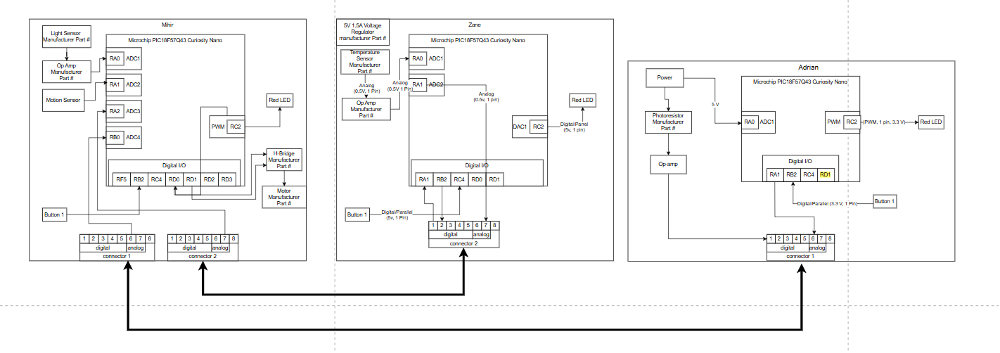

# Intro / Overview
The block diagram shows the system for our automatic curtain raiser designed by TechMinds. The diagram illustrates how each team member’s system interacts through a standardized 8-pin connector, giving a seamless connection and functionality between boards. Each team member was responsible for an individual subsystem based on the Microchip PIC18F57Q43 Curiosity Nano. The design follows a hub-and-spoke connection, where the lines are shared through the defined digital and analog channels.

---

# Dividing functionality across boards:

## Mihir’s Board
Acts as the central hub for sensor processing and motor/LED control.  
Reads analog signals from Zane’s DAC and Adrian’s potentiometers via connector pins 6–7.  
Controls outputs such as the H-bridge and LED locally.

## Zane’s board
Focused on sensing and signal generation.  
Temperature sensor input is read locally.  
DAC1 output is available to Mihir.  
Digital I/O pins are left unconnected for now.

## Adrian’s Board
Handles potentiometer inputs and local digital I/O (button and LED).  
Potentiometer analog signals are routed to Mihir.  
Digital outputs remain local.

> *"**Note:** This division ensures efficient connector usage: only necessary analog signals are shared, digital signals stay local, and GND is common across all boards, minimizing inter-board wiring."*

---

# Risk Assessment and De-Risking

### Potential Risks:
- Losing Zane - Mihir loses access to the DAC signal  
- Losing Mihir - system loses central hub and motor/LED control  
- Losing Adrian - Mihir loses potentiometer inputs  

### De-risk Strategies:
- Allocate extra ADC inputs on Mihir to handle signals if a teammate’s board becomes unavailable.  
- Group similar analog functions on consistent connector pins to facilitate easier rerouting.  
- Keep digital outputs local to minimize dependencies, allowing boards to operate independently if needed.  

---

# Conclusion
The team confirmed that the proposed layout:  
- Balances functionality  
- Meets project requirements  
- Minimizes risk  

This groundwork ensures the block diagram will clearly represent Mihir as the central hub, receiving analog signals from Zane and Adrian, while digital signals remain local.

