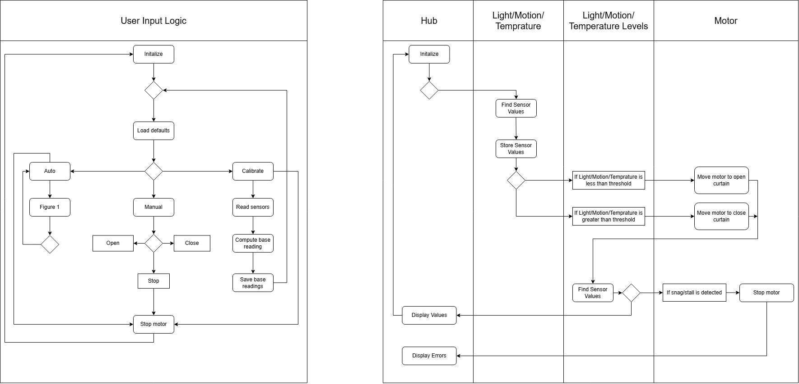

## Software Design: Block Diagram, Process Diagram, and Message Structure

This page provides an overview of the system and control logic for our team’s **automated curtain control system**. The diagrams illustrate how the main components — the **Hub Controller**, **Sensor Subsystem**, **Motor Control Subsystem**, and **User Input Logic** — interact and exchange data during operation.

The **block diagram** provides a general overview of how the components are interconnected. The **process (flow) diagram** illustrates the step-by-step logic of the software, encompassing setup, reading sensor data, validating user input, updating states, and controlling the motor.

---

### System Diagrams

**Embedded Block & Process Diagram (PNG):**  

---

### Source Files

- **View the editable draw.io source:**  
  [Open draw.io Diagram](https://drive.google.com/file/d/1kB1MB1A7WyH8kRUYDMvroCLTDriQc6d1/view?usp=sharing)

- **Download the .drawio file from GitHub repository:**  
  [Download from GitHub](https://github.com/ASU-EGR304-2025-F-206/EGR304-TechMinds/blob/main/docs/images/304SoftwareProposal.png)

--- 

### Decision-Making & Product Alignment

Our team structured the software architecture to strike a balance between modularity, robustness, and real-time responsiveness to environmental and user inputs.  
- The Hub Controller (Mihir’s board) manages decision-making and communication, ensuring synchronized operation between the motor and sensors.  
- Zane’s subsystem provides environmental sensing data (temperature) using analog inputs, while Adrian’s subsystem adds light-based feedback.  
- Each subsystem is designed to operate locally if disconnected, aligning with our risk mitigation strategy.

This software structure meets the product requirements by:
- Supporting automated curtain movement based on environmental cues (light, temperature).  
- Allowing manual override and LED feedback for testing and debugging.  
- Ensuring scalable integration of additional sensors or user inputs via the shared 8-pin connector and standard message-passing structure.

Our design process prioritized clear task separation, signal reliability, and maintainable code, making the overall system flexible and robust for future iterations.

---

### Version 2.0

The V2.0 software will utilize a new piece of encoder hardware to achieve precise, count-based motor control, moving beyond simple timed operation to enable accurate partial opening. This precision is complemented by a vital safety feature, obstruction detection, which immediately halts the motor if the expected encoder count is not reached, thereby preventing hardware damage and alerting the user. Furthermore, the automatic control logic has been upgraded to adaptive automation, which enables the system to analyze historical sensor data and dynamically adjust light and temperature thresholds. This provides a more intelligent and responsive curtain operation compared to the fixed V1.0 settings. Finally, the integration with the new Wi-Fi SoC enables essential quality-of-life features, including remote control via a mobile app and the ability to receive software updates.

