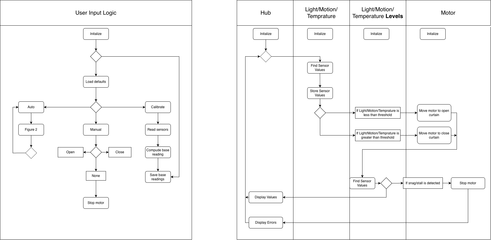

## Software Proposal: Block Diagram, Process Diagram, and Message Structure

This page shows the system overview and control logic for our team’s **automated curtain control system**. The diagrams explain how the main parts — the **Hub Controller**, **Sensor Subsystem**, **Motor Control Subsystem**, and **User Input Logic** — work together and exchange data during operation.

The **block diagram** gives a general view of how the components are connected. The **process (flow) diagram** shows the step-by-step logic of the software, including setup, reading sensor data, checking user input, updating states, and controlling the motor.

---

### System Diagrams

**Embedded Block & Process Diagram (PNG):**  

---

### Source Files

- **View the editable draw.io source:**  
  [Open draw.io Diagram](https://drive.google.com/file/d/1kB1MB1A7WyH8kRUYDMvroCLTDriQc6d1/view?usp=sharing)

- **Download the .drawio file from GitHub repository:**  
  [Download from GitHub](https://github.com/ASU-EGR304-2025-F-206/EGR304-TechMinds/blob/main/docs/images/304SoftwareProposal.png)

--- 

### Decision-Making & Product Alignment

Our team structured the software architecture to balance modularity, robustness, and real-time response to environmental and user inputs.  
- The Hub Controller (Mihir’s board) manages decision-making and communication, ensuring synchronized operation between the motor and sensors.  
- Zane’s subsystem provides environmental sensing data (temperature) using analog inputs, while Adrian’s subsystem adds light-based feedback.  
- Each subsystem is designed to operate locally if disconnected, aligning with our risk mitigation strategy.

This software structure meets the product requirements by:
- Supporting automated curtain movement based on environmental cues (light, temperature).  
- Allowing manual override and LED feedback for testing and debugging.  
- Ensuring scalable integration of additional sensors or user inputs via the shared 8-pin connector and standard message-passing structure.

Our design process prioritized clear task separation, signal reliability, and maintainable code, making the overall system flexible and robust for future iterations.
