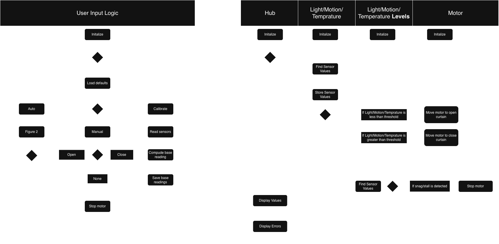

## Software Proposal: Block Diagram, Process Diagram, and Message Structure

This page presents the system-level overview and control logic of our team’s software proposal for the **automated curtain control system**.  
The diagrams included here illustrate the interaction between key subsystems — the **Hub Controller**, **Sensor Subsystem**, **Motor Control Subsystem**, and **User Input Logic** — and show how data and control messages flow between them during system operation.

The **block diagram** provides a high-level structural view of how the hardware and software components are interconnected.  
The **process (flow) diagram** outlines the software’s logical flow from initialization through the main control loop, including sensor sampling, user input handling, state updates, and motor output control.

---

### 🧭 System Diagrams

**Embedded Block & Process Diagram (PNG):**  

---

### 📂 Source Files

- **View the editable draw.io source:**  
  [Open draw.io Diagram](https://drive.google.com/file/d/1kB1MB1A7WyH8kRUYDMvroCLTDriQc6d1/view?usp=sharing)

- **Download the .drawio file from GitHub repository:**  
  [Download from GitHub](https://github.com/YourTeamGitHubUsername/YourRepoName/blob/main/assets/diagrams/304_Software_Proposal.drawio)

--- 